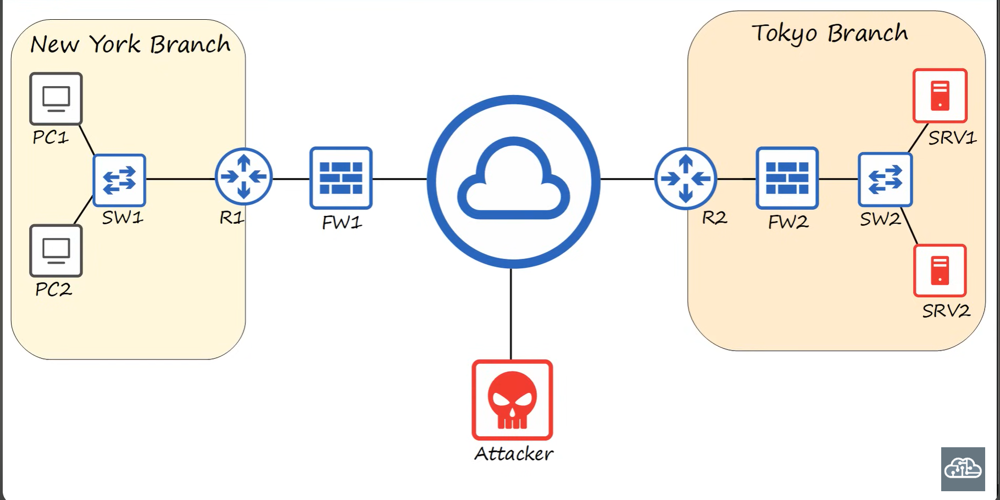

## What is a network?
A computer network is a digital telecommunications network which allows nodes to share resources.

## Network devices

- **switch**: 
    - have many network interfaces/ports for end hosts to connect to (usually 24+),
    - provide connectivity to hosts within the same LAN (Local Area Network),
    - do not provide connectivity between LANs/over the internet.
    - examples: Catalyst 9200, Catalyst 3650.
- **router**:
    - have fewer network interfaces than switches,
    - are used to provide connectivity between LANs,
    - are therefore used to send data over the internet.
    - examples: ISR 100, ISR 900, ISR 4000

- **firewalls**:
    - monitor and control network traffic based on configured rules, 
    - can be placed 'inside' the network, or 'outside' the network,
    - are known as 'Next-Generation Firewalls' when they include moders and advanced filtering capabilities.
    - Types:
        - Network Firewalls: Hardware devices that filter traffic between networks.
        - Host-based Firewalls: Software applications that filter traffic entering and exiting a host machine, like a PC.
    - examples: ASA5500-X, Firepower 2100, Windows Firewall

- **server**: A device that provides functions or services for clients.
- **client**: A devidce that access a service made available by a server.

## Quiz Questions
1. Your Company wants to purchase some network hardware to which they can plug the 30 PCs in your department. Which type of network device is appropriate?

    - [ ] a. A router  
    - [ ] b. A firewall  
    - [ ] c. A switch  
    - [ ] d. A server

    

    
Show Answer

    ✅ c. A switch
    

2. You received a video file from your friend's Apple iPhone using AirDrop. What was his iPhone functioning as in that transaction?
    - [ ] a. A server
    - [ ] b. A client
    - [ ] c. A local area network

    

    
Show Answer

    ✅ a. A server
    

3. What is your computer or smartphonw functioning as while you watch this video?
    - [ ] a. A server
    - [ ] b. An end host
    - [ ] c. A client

    

    
Show Answer

    ✅ c. A client
    

4. YOur company wants to purchase some network hardware to connect its separate networks together. What kind of network device is appropriate?
    - [ ] a. A firewall  
    - [ ] b. A host  
    - [ ] c. A LAN  
    - [ ] d. A router

    

    
Show Answer

    ✅ d. A router
    

5. YOur company wants to upgrade its old network firewall that has been in use for several years to one that provides more advanced functions. What kind of firewall should they purchase?
    - [ ] a. A host-based firewall  
    - [ ] b. A next-level firewall  
    - [ ] c. A next-generation firewall  
    - [ ] d. A top-layer firewall

    

    
Show Answer

    ✅ c. A next-generation firewall
    
