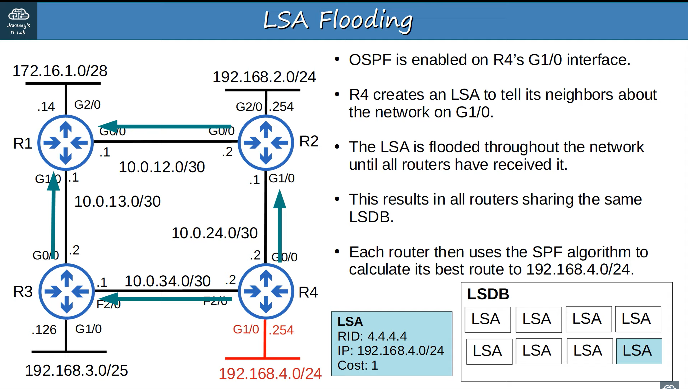

# Open Shortest Path First (OSPF) - Part 1

## Types of dynamic routing protocols

 

## Link State Routing Protocols

- When using **link state** routing protocol, every router creates a 'connectivity map' of the network.
- To allow this, each router advertises information about its interfaces (connected networks) to its neighbors. These advertisements are passed along to other routers, until all routers in the network develop the same map of the network.
- Each router independently uses this map to calculate the best routes to each destination.
- Link state protocols use more resources (CPU) on the router, because more information is shared.
- However, link state protocols tend to be faster in reacting to changes in the network than distance vectors protocols.

## OSPF

- stands for **Open Shortest Path First**.
- Uses the **Shortest Path First** algorithm of Dutch computer scientist Edsger Dijkstra. (aka **Dijkstra's alforithm**)
- Three versions:
    - OSPFv1 (1989): OLD, not in use anymore
    - OSPFv2 (1998): Used for IPv4
    - OSPFv3 (2008): Used for IPv6 (can also be used for IPv4, but usually v2 is used)
- Routers store information about the network in LSAs (Link State Advertisements), which are organized in a structure called the LSDB (Link State Dataabase).
- Routers will flood LSAs until all routers in the OSPF area develop the same map of the network (LSDB).

## LSA Flooding



> Each LSA has an afinge timer (30 min by default). The LSA will be flooede again after the timer expires.

## Quick summarization

In OSPF, there are three main steps in the process of sharing LSAs and determining the best route to each destination in the network.

1. **Become neighbors** with other routers connected to the same segment.
2. **Exchange LSAs** with neighbor routers.
3. **Calculate the best routes** to each destination, and insert them into the routing table.

## OSPF Areas

- OSPF uses **areas** to divide up the network.
- Small networks can be single-area without any negative effects on performance.
- In larger networks, a single-area design can have negative effects:
    - the SPF algorithm takes more time to calculate routes
    - the SPF algorithm requires exponentially more processing power on the routers
    - the larger LSDB takes up more memory on the routers
    - any small change in the network causes every router to flood LSAs and run the SPF algorithm again
- By dividing a large OSPF network into several smaller areas, you can avoid the above negative effects.

### Importants terms

- An **areas** is a set of routers and links that share the same LSDB.
- The **backbone area** (area 0) is an area that all other areas must connect to.
- Routers with all the interfaces in the same area are called **internal routers**.
- Routers with interfaces in multiple areas are called **area border routers (ABRs)**.
- Routers connected to the backbone area (area 0) are called **backbone routers**.
- An **intra-area route** is a route to a destination inside the same OSPF area.
- An **interarea route** is a route to a destination in a different OSPF area.

> - OSPF area should be contiguous.
> - All OSPF areas must have at least one ABR connected to the backbone area.
> - OSPF interfaces in the same subnet must be in the same area.

### Basic OSPF configuration

```
router ospf <1-65535> # process id
network 10.0.12.0 0.0.0.3 area 0
network 10.0.13.0 0.0.0.3 area 0
network 172.16.1.0 0.0.0.15 area 0
```

> The network command tells OSPF to ...
> - look for any interfaces with an IP address contained in the range specified in the newtork command.
> - Activate OSPF on the interface in the specified area.
> - The router will then try to become OSPF neighbors with other OSPF-activated neighbors routers

```
passive-interface g2/0
# The passie-interface command tells the router to stop sending OSPF 'hello' messages out of the interface.
# However, the router will continue to send LSAs informing it's neighbors about the subnet configured on the interface.
# You should always use this command on interfaces which don't have any OSPF neighbors.
```

---

# Open Shortest Path First (OSPF) - Part 2

## OSPF cost
- OSPF's metric is calld **cost**.
- It is automatically calculated based on the bandwidth (speed) of the interface.
- It is calculated by dividing a reference bandwidth value by the interface's bandwidth.
- The default reference bandwidth is 100mbps.
    - Reference: 100 mbps / Interface: 10 mbps = cost of 10
    - Reference: 100 mbps / Interface: 100 mbps = cost of 1
    - Reference: 100 mbps / Interface: 1000 mbps = cost of 1
    - Reference: 100 mbps / Interface: 10000 mbps = cost of 1
- All values less than 1 will be converted to 1.
- Therefore FastEthernet, Gigabit Ethernet, 10 Gig Ethernet, etc are equal and all have a cost of 1 by default
- You can (and should!) change the reference bandwidth with this command:
`R1(config-router)# auto-cost reference-bandwidth <mega-bits-per-second>`
    - the command is entered in megabits per second (default is 100)
    - you should conifigure a reference bandwidth greater than the fastest links in your network. (to allow for future upgrades)
    - You should configure same reference bandwidth on all OSPF routers in the neighbors.

- Three ways to modify OSPF cost:
    - Change the **reference bandwidth**:
    `auto-cost reference-bandwidth <mbps>`
    - Manual configuration
    `ip ospf cost <cost>`
    - Change the **interface bandwidth**:
    `bandwidth <kbps>`

## OSPF Neighborsf 