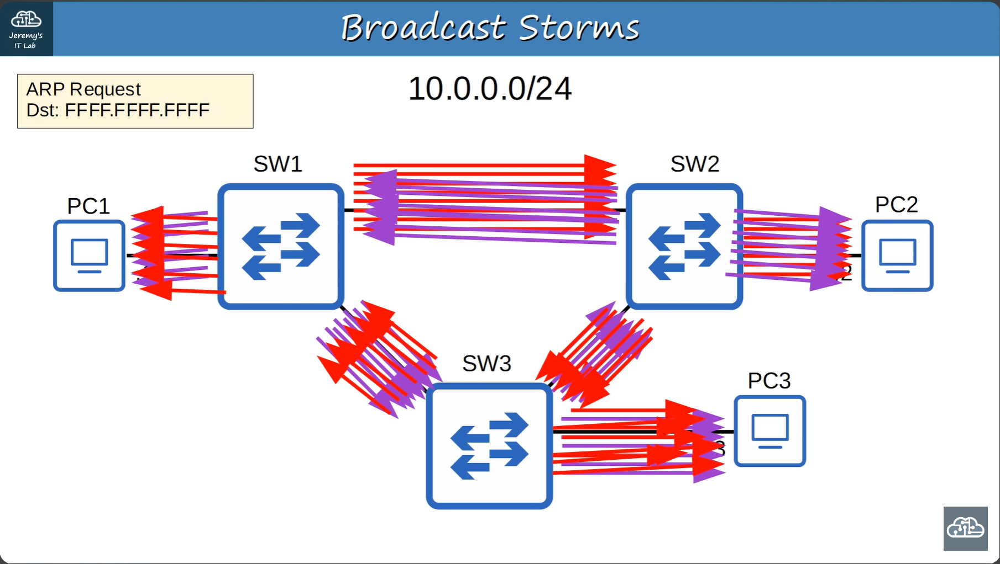

# 🌐 Spanning Tree Protocol (STP) Cheat Sheet

## 🛡️ What is STP?

**Spanning Tree Protocol (STP)** is a Layer 2 protocol (IEEE 802.1D) that prevents network loops in Ethernet networks by selectively blocking redundant paths. It ensures a loop-free topology while providing redundancy.

---

## 🏗️ Why Do We Need STP?

- **Redundancy** is vital for high availability in networks.
- Without STP, redundant links can cause **broadcast storms** and **MAC address flapping**.
- STP automatically disables redundant paths, activating them only if the primary path fails.

---

## 🚨 Problems Without STP

- **Broadcast Storms:** Ethernet frames loop endlessly, congesting the network.
- **MAC Address Flapping:** Switches constantly update MAC tables due to looping frames, causing instability.



---

## 🔄 How STP Works

1. **Elects a Root Bridge** (the central switch in the topology).
2. **Calculates the shortest path** from all switches to the root bridge.
3. **Designates ports** as either:
   - **Forwarding:** Actively passing traffic.
   - **Blocking:** Preventing loops by not forwarding user traffic.

---

## 🏆 STP Election Process

### 1. Root Bridge Election

- All switches send BPDUs (Bridge Protocol Data Units).
- The switch with the **lowest Bridge ID** becomes the **Root Bridge**.
- All ports on the Root Bridge are **Designated Ports** (forwarding).

### 2. Root Port Selection (on non-root switches)

- Each switch selects **one Root Port** (the port with the lowest cost path to the Root Bridge).
- Selection criteria:
  1. **Lowest root path cost**
  2. **Lowest neighbor Bridge ID**
  3. **Lowest neighbor Port ID**

### 3. Designated Port Selection (per collision domain)

- In each segment, one port is the **Designated Port** (forwarding).
- The other port(s) become **Non-Designated** (blocking).
- Selection criteria:
  1. **Lowest root path cost**
  2. **Lowest Bridge ID**

---

## 📝 STP Port Roles

| Role              | Description                                      |
|-------------------|--------------------------------------------------|
| Root Port         | Best path to the root bridge (one per switch)    |
| Designated Port   | Best path for a segment (one per collision domain)|
| Non-Designated    | Blocks traffic to prevent loops                  |

---

## ⚡ STP Cost Table

| Speed     | STP Cost |
|-----------|----------|
| 10 Mbps   | 100      |
| 100 Mbps  | 19       |
| 1 Gbps    | 4        |
| 10 Gbps   | 2        |

---

## 🕒 STP Timers

- **Hello Time:** 2 seconds (default)
- **Forward Delay:** 15 seconds
- **Max Age:** 20 seconds

---

## 💡 Best Practices & Tips

- Always enable STP on networks with redundant links.
- Monitor for **topology changes** (can cause brief outages).
- Use **Rapid STP (RSTP, 802.1w)** for faster convergence in modern networks.

---

## 🔗 References

- [Cisco STP Overview](https://www.cisco.com/c/en/us/support/docs/lan-switching/spanning-tree-protocol/5234-5.html)
- [Wikipedia: Spanning Tree Protocol](https://en.wikipedia.org/wiki/Spanning_Tree_Protocol)

---

> **Summary:**  
> STP is essential for preventing Layer 2 loops, ensuring network stability, and providing redundancy. Understand the election process, port roles, and cost calculation for effective troubleshooting and design.

## Spanning Tree Port States

| STP port State | Stable/Transitional | Description |
|----------------|---------------------|-------------|
| Blocking       | Stable              | Does not forward frames, listens to BPDUs only. Prevents loops. |
| Listening      | Transitional        | Does not forward frames or learn MAC addresses. Processes BPDUs to determine port role. |
| Learning       | Transitional        | Does not forward frames but begins learning MAC addresses. |
| Forwarding     | Stable              | Normal operation - forwards frames and learns MAC addresses. |
| Disabled       | Stable              | Administratively shut down, does not participate in STP. |

1. Blocking State
  - Non-designated ports are in a **Blocking** State.
  - Interfaces in a Blocking state are effectively disabled to prevent loops.
  - Interfaces in a Bloking state do not send/receive regular network traffic.
  - Interfaces in a Blocking state receive STP BPDUs.
  - Interfaces in a BLocking state do NOT forward STP BPDUs.
  - Interfaces in a Blocking state do NOT learn MAC addresses.

2. Listening State
  - After Blocking state, interfaces with the Designated or Root role enter the **Listening** state.
  - Only **Designated** or **Root** prots enter the Listening state (Non-designated prots are always Blocking)
  - The Listening state is 15 seconds long by default. This determined by the **Forward delay** timer.
  - An interface in the listening state only forwaerds/receives STP BPDUs.
  - An interfae in the Listening state does Not send/receive regular traffic
  - An interface in teh listening state dows not learn MAC address from regular traffic that arrives on the interface.

3. Learning State
  - After the listening state, a designated or root port will enter the **learning** state. 
  - teh learning state is 15 seconds long by default. This is determined by the **Foward delay** timer (the same timer used for both the listening and learning states).
  - An interface in teh learning state only sends/receives STP BPDUs.
  - An interface in the learning state doesnot send/receive regular traffic.
  - An interface in the Learning state *learns* MAC addresses from regular traffic that arrives on the interface.

4. Forwarding state
  - Root and Designate ports are in a Forwarding state.
  - A port in the Forwarding state operate as notmal.
  - A port in the forwarding state sends/receives BPDUs.
  - A port in the Forwarding state sends/receives normal traffic.
  - A port in the Forwarding state learns MAC addresses.

## Spanning Tree Timers

| STP Timer | Purpose | Duration |
|-----------|---------|----------|
| Hello | How often the root bridge sends hellp BPDUs | 2 sec|
| Forward delay | How long the switch will stay in the Listening and Learning states (each state is 15 seconds = total 30 seconds) | 15 sec |
| Max Age | How long and interface will wait after ceasing to receive Hello BPDUs to change the STP topology | 20 sec (10* hello) |

- If another BPDU is received before teh max age timer counts down to 0, the time will reset to 20 seconds and no changes will occus.
- If another BPDUs is not receibed, the max age timer counts down t0 0 and the switch will reevaluate its STP choices, including root bridge, local root, designated and non-designated ports.
- If a non-designated port is selected to become a designated or root port, it will transition from the blocking state to the listening state (15 seconds), learning state (15 seconds), and then finally the forwarding state. Som it can take a total of 50 seconds for a blocking interface to transition to forwarding.
- These timers and transitional states are to make sure teh loops aren't accidentally created by an interface moving to forwarding state too soon.

## Spanning Tree Opitonal Features (STP Toolkit)

1. Portfast
  - Portfast allows a port to move immediately to teh forwarding state, bypassing Listening and Learning
  - If used, it must be enables only on ports connected to end hosts.
  - If enabled on a port connected to another switch it could cause a layer 2 loop.
  - ```
    interface g0/2
    spanning-tree portfast
    ```
  - You can also enable portfast with the following command: `spanning-tree portfast default`. This enables portfast on all access port (not on trunk ports).

2. BPDU guard
  - if an interface with BPDU guard enabled receives a BPDU from another switch, the interface will be shut down to prevent a loop from forming.
  - ```
    interface g0/2
    spanning-tree bpduguard enable
    ```
  - YOu can also enable BPDU guard with the following command: `spanning-tree bpduguard default`. This enables BPDU fuard on all Portfast-enabled interfaces.

3. Root Guard
  - If you enable root guard on an interface, even if it receives a superior BPDU (lower bridge ID) on that interface, teh switch will not accept the new switch as the root bridge. The interface will be disabled.\
  
4. Loop guard
  - If you enable loop guard on an interface, even if the interface stops receiving BPDUs, it will not start forwarding. The interface will be disabled.

## Configure the spanning tree mode
```
spanning-tree mode mst
spanning-tree mode pvst
spanning-tree mode rapid-pvst
```
## configure the primary root bridge
```
sw3(config)#spanning-tree vlan 1 root primary
sw3(config)#do show spanning-tree
```
The `spanning-tree vlan <vlan-number> root primary` command sets tha STP priority to 254576. If another switch already has a priority lower than 24576, it sets this switch priority to 4096 less than the other switch's priority

```
sw2(config)#spanning-tree vlan 1 root secondary
sw2(config)#do show spanning-tree
```
The `spanning-tree vlan <vlan-number> root secondary` command sets tha STP priority to 28672.

Alternative:
`spanning-tree vlan 1 priority <0-61440>`

## configure STP port settings
```
spanning-tree vlan 1 cost <1-200000000>
spanning-tree vlan 1 port-priority <0-224>
```
