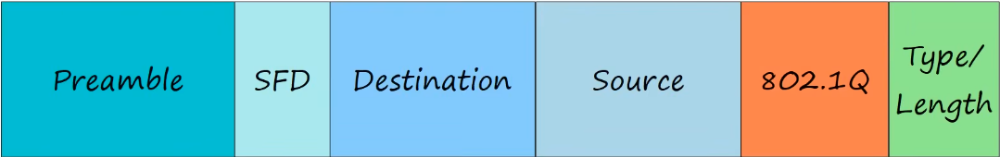

# <center>🌐 Virtual Local Area Network (VLAN) 🌐</center>

## ⭐ Key Concepts

- **VLAN**: Segments a physical network into multiple logical networks, improving security and performance.
- **Access Port**: Connects end devices; belongs to one VLAN.
- **Trunk Port**: Connects switches/routers; carries multiple VLANs using tags.
- **VLAN Tagging**: 802.1Q inserts a 4-byte tag into Ethernet frames to identify VLANs.
- **Native VLAN**: Untagged traffic on a trunk is assigned to the native VLAN.
- **VLAN Ranges**: 1-1005 (normal), 1006-4094 (extended).
- **ROAS**: Allows inter-VLAN routing using a single router interface with subinterfaces.

---

## What is LAN?

- LAN is a group of devices (PCs, servers, routers, switcher, etc) in a single location (home, office, etc).
- A more specific definition: A LAN is a single **broadcast domain**, including all devices in that broadcast domain.
    - A **broadcast domain** is the group of devices which will receive a broadcast frame (destination MAC FFFF.FFFF.FFFF) sent by any one of the members. 


## What is a VLAN?

- It's essentially a way to logically split up a layer 2 broadcast domain, to make multiple separate broadcast domains.

VLANs...

- are configured on switches on a per-interface basis
- **logically** separate end hosts at layer 2.

> 📝 Switches do not forward traffic directly between hosts in different VLANs.

## What is the purpose of VLANs?

- **Network performance**: helps to reduce unnecessary broadcast traffic, which helps prevent network congestion and improve network performance.

- **Network Security**: limiting broadcast and unknown unicast traffic also improves network security since these messages won't be received by devices outside of the VLAN.

## VLAN configuration


```cli
show vlan brief
interface range g1/0 - 3
switchport mode access
switchport access vlan 10
```

- An access port is a switchport which belongs to a single VLAN, and usually connects to end hosts like PCs.
- Switchports which carry multiple VLANs are called **trunk ports**.

```
# manually create and name VLANs

vlan 10
name Engineering
vlan 20
name HR
```

## What is a Trunk port?

- In a small network with few VLANs, it is possible to use a separate interface for each VLAN when connecting switches to switches, and switches to routers.

- However, when the number of VLANs increases, this is not viable. It will result in wasted interfaces, and often routers won't have enough interfaces for each VLAN.

- We can use **trunk ports** to carry traffic from multiple VLANs over a single interface.

> 💡 Switches will 'tag' all frames that they send over a trunk link. This allows the receiving switch to know which VLAN the frame belongs to.

> Trunk ports = 'tagged' port <br>
> Access Ports = 'untagged' ports

## VLAN Tagging

- There are two main trunking protocols: ISL (Inter-Switch Link) and IEEE 802.1Q (dot1q).
- ISL is an old Cisco proprietary protocol created before the industry standard IEEE 802.1Q.
- IEEE 802.1Q is an industry standard protocol created by the IEEE (Institute of Electrical and Electronics Engineers).



- The 802.1Q tag is inserted between the **Source** and **Type/Length** fields of the Ethernet frame.
- The tag is 4 bytes (32 bits) in length.
- The tag consists of two main fields:
    - Tag Protocol Identifier (TPID)
    - Tag Control Information (TCI)


1. TPID (Tag Protocol Identifier)
    - 16 bits (2 bytes) in length
    - Always set to value of `0x8100`. This indicates that the frame is 802.1Q-tagged.

2. PCP (Priority Code Point)
    - 3 bits in length
    - Used for Class of Service (CoS), which prioritizes important traffic in congested networks.

3. DEI (Drop Eligible Indicator)
    - 1 bit in length
    - Used to indicate frames that can be dropped if the network is congested.

4. VID (VLAN ID)
    - 12 bits in length
    - Identifies the VLAN the frame belongs to.
    - 12 bits in length = 4097 total VLANs (2<sup>12</sup>), range of 0 - 4095
    - VLANs 0 and 4095 are reserved and can't be used.
    - Therefore, the actual range of VLANs is 1-4094.

> Cisco proprietary ISL also has VLAN range of 1 - 4094.

## VLAN Ranges

- The range of VLANs (1-4094) is divided into two sections: 
    - Normal VLANs: 1 - 1005
    - Extended VLANs: 1006 - 4094
- Some older devices cannot use the extended VLAN range, however it's safe to expect that modern switches will support the extended VLAN range.

## Native VLAN

- 802.1Q has a feature called the **native VLAN**. (ISL does not have this feature)
- The native VLAN is VLAN 1 by default on all trunk ports, however this can be manually configured on each trunk port.
- The switch does not add an 802.1Q tag to frames in native VLAN.
- When a switch receives an untagged frame on a trunk port, it assumes the frame belongs to the native VLAN.

## Trunk Configuration


```
interface g0/0
switchport mode trunk  -> Error: An interface whose trunk encapsulation is "Auto" can not be configured to "trunk" mode.

switchport trunk encapsulation dot1q
switchport mode trunk
show interfaces trunk

switchport trunk allowed vlan 10,30
do show interfaces trunk

switchport trunk allowed vlan add 20

switchport trunk allowed vlan remove 20 
```

## ROAS (Router on a Stick)

- ROAS is used to route between multiple LANs using a single interface on a router and switch.
- The switch interface is configured as a regular trunk.
- The router interface is configured using **subinterfaces** (g0/0.10). You configure the VLAN tag and IP address on each subinterface.
- The router will behave as if frames arriving with a certain VLAN tag have arrived on the subinterface configured with that VLAN tag.
- The router will tag frames sent out of each subinterface with the VLAN tag configured on the subinterface.

```
interface eth1
no switchport
no shutdown

interface eth1.10
description "subinterface for vlan 10"
encapsulation dot1q vlan 10
ip addr 10.0.0.62/26
```

---

## 📋 Quick Summary Table

| Concept         | Description                                                                 |
|-----------------|-----------------------------------------------------------------------------|
| VLAN            | Logical separation of broadcast domains at Layer 2                           |
| Access Port     | Carries traffic for a single VLAN (untagged)                                |
| Trunk Port      | Carries traffic for multiple VLANs (tagged)                                 |
| Native VLAN     | Default VLAN for untagged frames on a trunk (usually VLAN 1)                |
| 802.1Q          | Industry standard VLAN tagging protocol                                     |
| ISL             | Cisco proprietary VLAN tagging protocol (legacy)                            |
| ROAS            | Router on a Stick – routing between VLANs using subinterfaces               |

## 📝 Pro Tips

- Always match native VLANs on both ends of a trunk link to avoid security risks.
- Use descriptive VLAN names for easier management.
- Limit the number of VLANs allowed on trunk ports for better control.
- Regularly verify VLAN and trunk configurations with `show` commands.

---