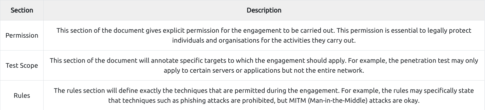

## Pentesting Fundamentals

<strong>Pentesting</strong>
- Ethically driven attenpt to test and analyze the security defences to protect digital assets and pieces of information,
- authorized audit,
- Rules of Engagement(ROE) is a document that is created at the initial stages of pentesting,
    - consists of 3 main sections:
    
    