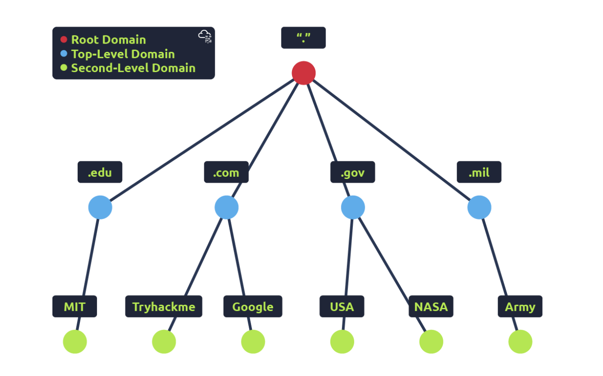

# 
DNS in details

## DNS hirearchy
    - root domain
    - top-level domain(right hand part)
    - Second level domain
    - sub domain(left hand part)

### top level domain(tld)
- two types: gTLD(generic) and ccTLD(country code)
- gTLD tells the domain name's purpose.
    - .com -> commercial
    - .org -> organizational
    - .edu -> educational etc

- for tryhackme.com, .com is the TLD (ccTLD)

- ccTLD used for geographical purposes
    - .np -> Nepal
    - .in -> India
    - .ca -> Canada

### Second level domain

- for tryhackme.com, tryhackme is the second level domain
- while registering, limited to 63 charachers
- can only use a-z, 0-9, hyphens(-) (cannot start or end with hyphens or have consecutive hyphens).

### Subdomain

- admin.tryhackme.com, admin is the subdomain.
- jupiter.servers.tryhackme.com, jupiter.servers is the subdomain
- can use multiple subdomains split with periods to create longer names
- limited to 63 characters, but overall domain name should not exceed 253 characters

## DNS record types

- A
    - resolves ipv4 address
    - nslookup -type=A website.com
- AAAA
    - resolves ipv6 address
    - nslookup -type=AAAA website.com
- CNAME
    - (canonical name)
    - resolves another domain name
    - TryHackMe's online shop has the subdomain name store.tryhackme.com which returns a CNAME record shops.shopify.com
    - nslookup -type=CNAME website.com
- MX
    - resolve to the address of the servers that handles the email for the domain 
    - comes with priority flag
    - nslookup -type=MX website.com
- TXT
    - free text fields, where any text-based data can be stored
    - nslookup -type=A website.com

## Making a DNS request

- first computer checks its local cache
- if not found, it checks in the recursive domain server (usually provided by the  ISP, but u can also have your own)
- else it checks in the root DNS server(which acts as the DNS backbone of the internet)
    - it's job is to redirect you to correct TLD server
- TLD server holds record for where to find authoritative server(name server)
- Authoritative DNS server stores the DNS records for a particular domain name and where any updates to your domain name.
    - DNS records all come with a TTL (Time To Live) value(represented in seconds).

