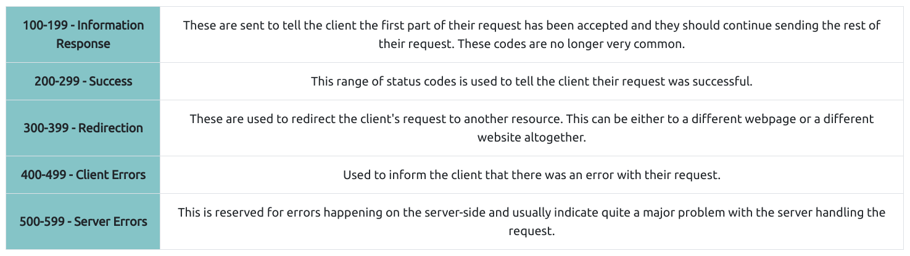

# 
HTTP in details

## HTTP Methods
    - GET Request -> used for getting information from a web server.
    - POST Request -> used for submitting data to the web server and potentially creating new records.
    - PUT Request -> used for submitting data to web server to update information.
    - DELETE Request -> used for deleting information/records from a web server.

## HTTP Status Codes

- HTTP status codes
    - 

- Common HTTP status codes
    - 

## Headers

### Common request headers

- are sent from the client(usually your browser) to the server.

- Host
    - providing host header you can tell which website you require,
    - you'll just get default website if host is not mentioned.

- User-Agent
    - specify browser software and version number

- Content-Length
    - tells webserver how much data to expect in the web request.

- Accept-Encoding
    - tells webserver what types of compression methods the browser supports.

- Cookie
    - data sent to the server to help remember your information

### Common response headers

- are returned to the client from the server after request.

- Set-Cookie
    - information to store which gets sent back to the web server on each request

- Cache-Control
    - how long to store response in the browser's cache

- Content-Type
    - tells client what type of data is being returned.

- Content-Encoding
    - what method has been used to compress the data to make it smaller when sending it over the internet.
