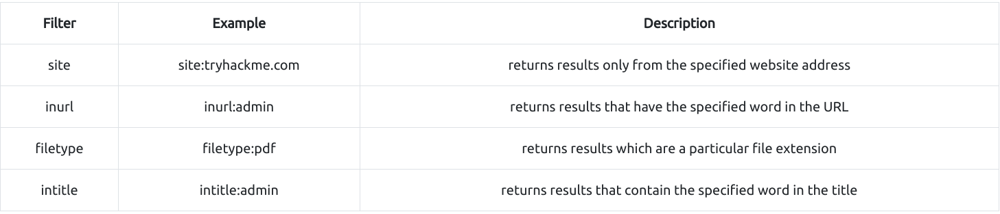
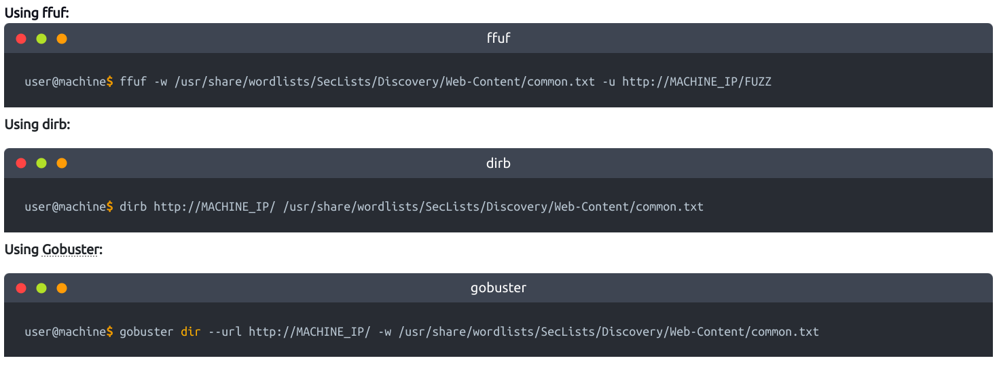

# <center>Content Discovery</center>

<b>three main ways of discovering content on a website</b>
- Manually
- Automated
- OSINT (Open-Source Intelligence)

## Manual Discovery
### Robots.txt
- text file that tells search engine which pages they are and aren't allowed to crawl.
- file gives us a great list of locations on the website taht owners don't want us to discover as penetration testers.
- https://examplewebsite.com/robots.txt

### Favicon
- if a web developer doesn't replace this with custom one, this can give us a clue on what framework is in use.
- [Click me](https://wiki.owasp.org/index.php/OWASP_favicon_database) to see the common framework icons that you can use to check against the targets favicon.
- Grab favicon on linux
    - ``` curl https://examplewebsite.com/Path_to_favicon | md5sum ```
- Grab favicon on windows powershell
    - ``` 
        C:\> curl https://website.com/path_to_favicon -UseBasicParsing -o favicon.ico
        C:\> Get-FileHash .\favicon.ico -Algorithm MD5 ```

### Sitemap.xml
- opposite of robots.txt
- lists every fine owner wishes to be listed on a search engine
- https://examplewebsite.com/sitemap.xml

### HTTP Header
- server returns various HTTP headers when we make requests
- contains useful information such as software version, scripting language in use, etc.
- <b>curl</b> command is used to transfer information using url, and can be used to get the http headers.
```bash
    curl https://target_ip_address -v
```

### Framework stack
- once framework of a website is established, we can learn more about the software and other information,
- can help us to increase out attack surface

## OSINT (Open-Source Intelligence)
- external resources available that can help in discovering information about your target website,
- they are freely available tools that can collect information.

### Google-Hacking / Dorking



### Wappalyzer

- online tool and browser extension that helps identify what technologies a website uses, such as frameworks, Content management system (CMS) etc

### Wayback Machine

- [Click me](https://archive.org/web/) to access Wayback Machine
- shows all the times the service scraped the web page and save contents.
- can help uncover old pages that may still be active on the current website

### Github

- hosted version of Git on the internet
- can use Github's search feature to look for company names or website names, and once discovered, we may have access to source code, passwords or other contents.

### S3 Buckets

- storage service provided by Amazon AWS
- format of S# buckets is http(s)://{name}.s3.amazonaws.com where {name} is decided by the owner.
- example https://tryhackme-assets.s3.amazonaws.com
- commonly used as company name followed by common terms such as: {name}-assets, {name}-www, {name}-public, {name}-private, etc.

## Automated Discovery

- Uses automation tools like ffuf, dirb, gobuster.

- examples:
